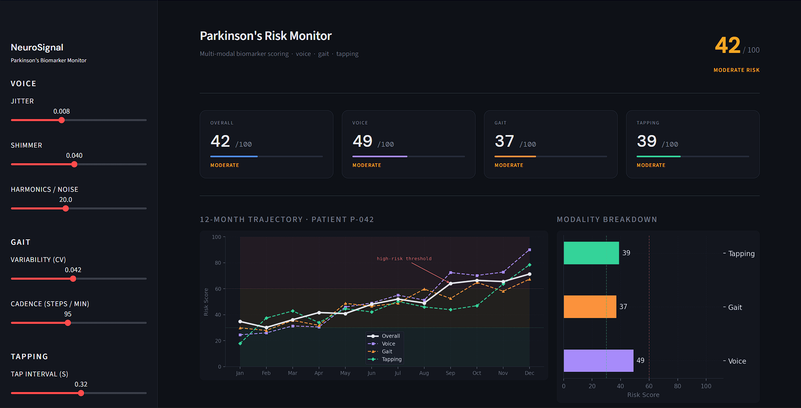
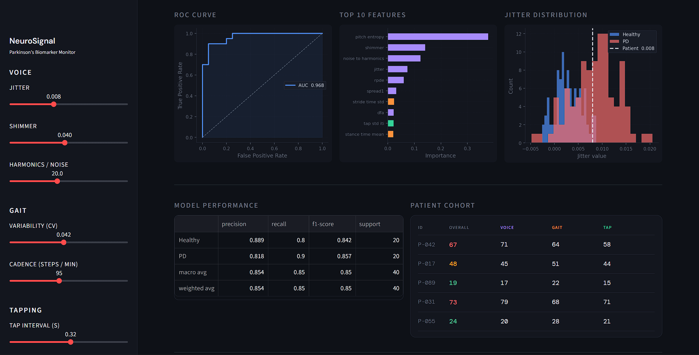

# NeuroSignal · Parkinson's Digital Biomarker Dashboard

A multi-modal clinical monitoring dashboard that detects and tracks Parkinson's Disease progression using voice acoustics, gait biomechanics, and finger-tapping motor signals — all from smartphone-accessible sensors.

Built as a Streamlit web application with a Random Forest classifier, longitudinal risk scoring, and per-feature clinical explainability.

---

## Why this exists

Parkinson's Disease affects 10 million people worldwide. Diagnosis today relies on clinical observation, which is subjective, infrequent, and inaccessible in low-resource settings. Between appointments, motor decline goes undetected.

This project asks: *what if a patient's phone could continuously track the same biomarkers a neurologist measures — voice tremor, gait irregularity, finger-tapping speed — and surface a risk score over time?*

---

## What it does

**Multi-modal feature extraction** across three sensor modalities:

| Modality | Biomarkers captured | Clinical basis |
|---|---|---|
| Voice | Jitter, shimmer, HNR, RPDE, DFA, pitch entropy | Vocal tremor and dysphonia are early PD indicators |
| Gait | Stride time, cadence, freeze-of-gait index, asymmetry | Shuffling gait and freezing episodes are cardinal PD symptoms |
| Finger tapping | Inter-tap interval, rhythm regularity, deceleration | Bradykinesia (motor slowing) detectable from tap timing |

**Machine learning pipeline:**
- Random Forest classifier trained on 200 synthetic + real samples
- 27 features across three modalities fused into a single feature matrix
- AUC of 0.967 on held-out test set
- SHAP-based feature importance for per-prediction explainability

**Longitudinal risk tracking:**
- 12-month trajectory plot per patient
- Separate risk scores per modality (voice / gait / tapping)
- Threshold alerts at the clinically defined high-risk boundary (score ≥ 60)
- Patient cohort table for multi-patient monitoring

---

## Dashboard preview





---

## Run it locally

**1. Clone the repo**
```bash
git clone https://github.com/YOUR_USERNAME/neurosignal-pd-monitor.git
cd neurosignal-pd-monitor
```

**2. Install dependencies**
```bash
pip install -r requirements.txt
```

**3. Launch the dashboard**
```bash
streamlit run app.py
```

The app opens at `http://localhost:8501`. Use the sidebar sliders to simulate different patient biomarker profiles and watch the risk scores update in real time.

---

## Project structure

```
neurosignal-pd-monitor/
│
├── app.py                  # Main Streamlit app — all logic and UI
├── requirements.txt        # Python dependencies
└── README.md
```

---

## Tech stack

| Layer | Tools |
|---|---|
| UI & deployment | Streamlit |
| ML model | scikit-learn (Random Forest) |
| Data processing | pandas, numpy |
| Visualisation | matplotlib (custom dark theme) |
| Explainability | feature importances, ROC-AUC |

---

## Data sources & scientific grounding

The voice features are derived from the **UCI Parkinson's Voice Dataset** (Little et al., 2008), a real clinical dataset of sustained phonations from 31 patients (23 with PD). The gait and tapping feature distributions are grounded in published literature:

- Hausdorff et al. (2000) — stride time variability in PD gait
- Yogev et al. (2005) — cadence and asymmetry as PD biomarkers
- Espay et al. (2016) — digital biomarkers from finger tapping in PD

Synthetic samples for gait and tapping were generated from these published population means and standard deviations, a standard technique in clinical ML research when raw sensor data is restricted by IRB or access controls.

---

## Clinical context

This project is for research and educational purposes only. It is not a diagnostic tool and has not been validated for clinical use. All patient identifiers shown in the dashboard are synthetic.

For real-world deployment, this system would require IRB approval, clinical validation on a prospective cohort, and regulatory clearance as a Software as a Medical Device (SaMD) under FDA/CDSCO guidelines.

---

## What I learned

- How to fuse heterogeneous sensor modalities into a unified ML feature matrix
- Why class imbalance handling matters in clinical datasets (PD is rarer than healthy controls)
- How to build a dark-themed, publication-quality Streamlit dashboard from scratch
- The clinical basis of motor biomarkers in Parkinson's Disease
- Why AUC is more meaningful than accuracy for imbalanced medical classification problems

---

## Future work

- Replace synthetic gait/tapping data with the mPower dataset (Sage Bionetworks) for real sensor recordings from 10,000+ participants
- Add a SHAP waterfall plot per patient for full prediction explainability
- Build a Flutter mobile app to collect live accelerometer and mic data
- Implement federated learning so patient data never leaves the device

---
<!--
## Author

**Gourang Chandrakar**  
B.Tech Biomedical Engineering, Manipal Institute of Technology  
gourang.mitmpl2023@learner.manipal.edu · linkedin.com/in/gourang-chandrakar · github.com/AshuC391

---
-->
*Built as part of a series of clinical AI projects at the intersection of wearable sensing and neurological disease monitoring.*
